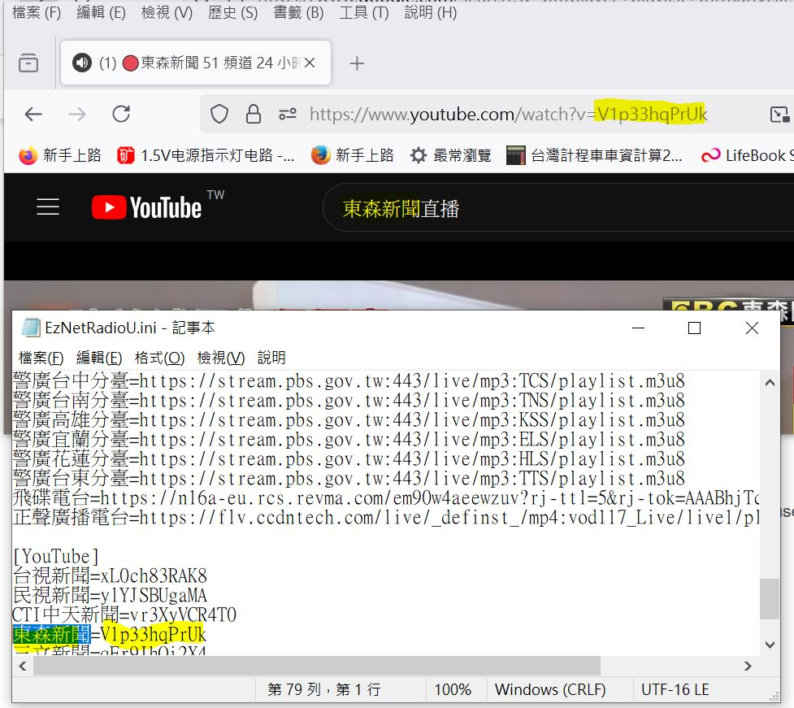

# EzNetRadioU_7.14.1
no code, modified INI, match Youtube link for TV live stream only. cahce here easy friends who was not computer geeks.

### how to uses
download this zip, upzip to any folder as you like, EzNetRadioU.exe, click and play.

### origination & the original author, not me!
http://cym6112.blogspot.com/search/label/%E7%B6%B2%E8%B7%AF%E6%94%B6%E9%9F%B3%E6%A9%9F

### setup of mine
copy of ffmpeg-dlls-6.1.1-win32-lgpl is included, easy normal user, no need setup, only donwload this whole package, and play those radio stream  

### INI file update
my copy and updated section of EzNetRadioU.ini to renew those broken links and obsoletion (2024-DEC-31)
```
[YouTube]
台視新聞=xL0ch83RAK8
民視新聞=ylYJSBUgaMA
CTI中天新聞=vr3XyVCR4T0
東森新聞=V1p33hqPrUk
三立新聞=qEr9JhQj2X4
TVBS NEWS=8-jkb6vb7Yo
```

### 如何修改/更新 youtube 連結
打開 INI 檔  
  

找到 YOUTUBE 連結, 抄寫到 INI 內, 存檔
  
